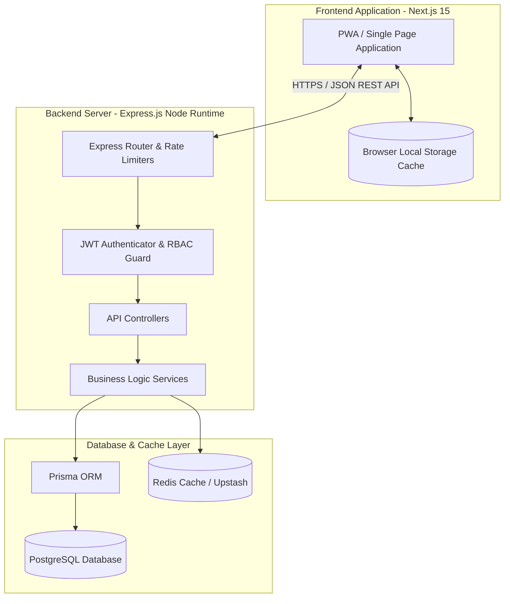
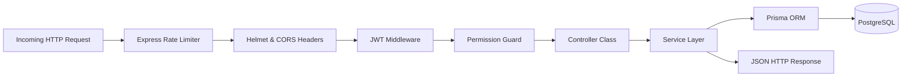
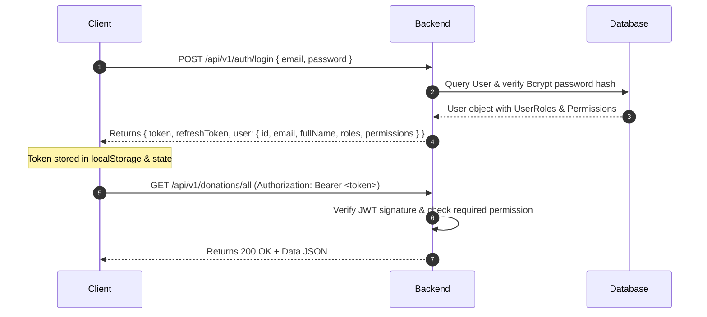
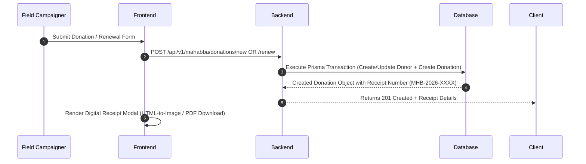
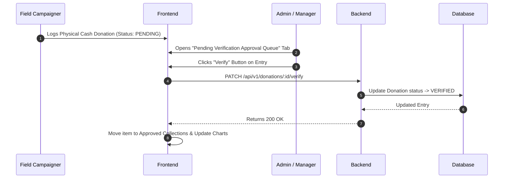
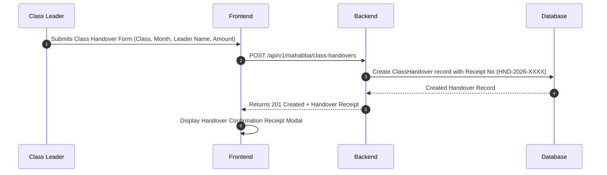
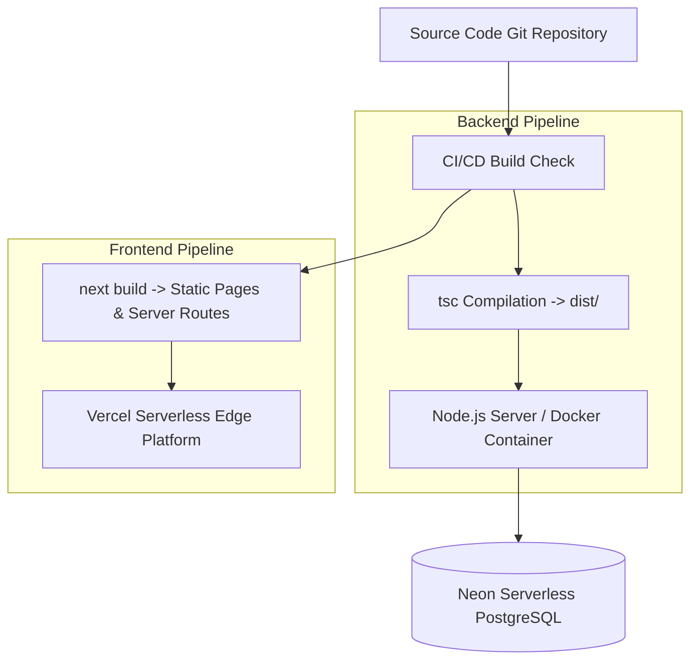

# System Architecture & Technical Specifications

> **Document Purpose**: This document provides an architectural breakdown of the **Token of Halawa** platform, detailing its system topology, data flow pipelines, authentication security model, build pipelines, and deployment strategy.

---

## Table of Contents
- [1. Overall System Architecture](#1-overall-system-architecture)
- [2. Frontend Architecture](#2-frontend-architecture)
- [3. Backend Architecture](#3-backend-architecture)
- [4. Folder Responsibilities](#4-folder-responsibilities)
- [5. Data Flow Architectures](#5-data-flow-architectures)
  - [Authentication & JWT Flow](#authentication--jwt-flow)
  - [Donation & Renewal Flow](#donation--renewal-flow)
  - [Physical Verification Flow](#physical-verification-flow)
  - [Class Handover Flow](#class-handover-flow)
  - [File / Image Generation Flow](#file--image-generation-flow)
- [6. Build & Deployment Flow](#6-build--deployment-flow)

---

## 1. Overall System Architecture

Token of Halawa uses a multi-tier decoupled web system design:

---

## 2. Frontend Architecture

The frontend is built on **Next.js 15 App Router** and **React 19**, styled using **Tailwind CSS**.

### Key Architectural Concepts:
1. **Single Entry Monolithic Dashboard Component (`DashboardOverview.tsx`)**:
   - Manages tab navigation (`analytics`, `entries`, `verify`, `campaigners`, `donors`, `rankings`, `handovers`, `developer`).
   - Adapts UI elements dynamically based on user role (`admin`, `leader`, `campaigner`, `developer`).
2. **Dual-Mode Data Layer**:
   - Fetches live records from the Express backend via `fetchDatabaseData()`.
   - Automatically falls back to offline state (`localStorage`) when network requests fail or offline PWA mode is active.
3. **Client-Side Document Rendering**:
   - Digital receipt modals (`ReceiptModal` and `MahabbaReceiptModal`) utilize HTML-to-Canvas rendering (`html-to-image`) and PDF creation (`jspdf`) entirely client-side without server rendering overhead.

---

## 3. Backend Architecture

The backend is built as a RESTful HTTP service using **Express.js**, **TypeScript**, and **Prisma ORM**.

### Architectural Principles:
- **Stateless Authentication**: Every protected request must carry a `Bearer <token>` HTTP header.
- **Granular Permissions (RBAC)**: Controllers check specific permission flags (`PERMISSIONS.DONATION_CREATE`, `PERMISSIONS.DONOR_DELETE`) before proceeding.
- **Database Transactions**: Multi-model writes (such as creating a donor alongside an initial donation entry) execute inside Prisma interactive transactions `$transaction` to ensure atomic updates.

---

## 4. Folder Responsibilities

| Directory Path | Primary Purpose | Architectural Role | Safe to Modify? |
| :--- | :--- | :--- | :--- |
| `/backend/prisma` | Database schema & migrations | Data Model Source of Truth | ⚠️ Schema migrations only |
| `/backend/src/routes` | REST endpoint routing | Transport Mapping Layer | 🟢 Safe for new endpoints |
| `/backend/src/controllers` | HTTP Request/Response handling | API Controller Layer | 🟢 Safe for endpoint logic |
| `/backend/src/services` | Core business logic & database queries | Domain Service Layer | 🟢 Safe for DB operations |
| `/backend/src/middleware` | Security, JWT, error handling | Cross-Cutting Concerns | 🛑 Core Security Guard |
| `/frontend/src/app` | Next.js App Router pages | Entry Points & Route Shells | 🟢 Safe for page wrappers |
| `/frontend/src/components` | Reusable React UI & Modals | UI Component Layer | 🟢 Safe for UI edits |
| `/frontend/src/store` | Client state stores | Client State Layer | 🟢 Safe for state logic |

---

## 5. Data Flow Architectures

### Authentication & JWT Flow

### Donation & Renewal Flow

### Physical Verification Flow

### Class Handover Flow

---

## 6. Build & Deployment Flow

